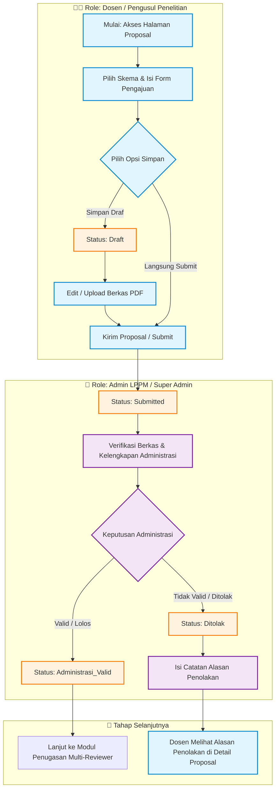
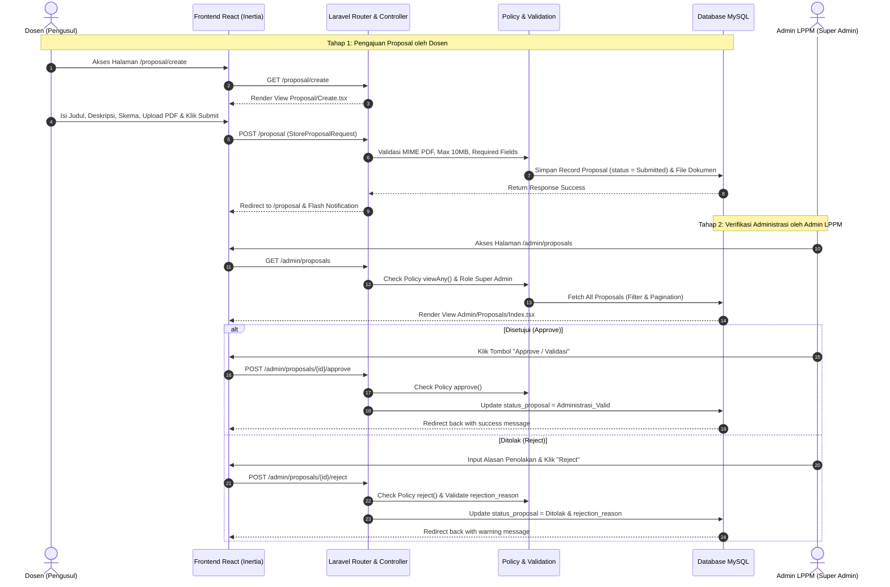

## 📊 Alur Proses Bisnis & Diagram Alur (Flowchart & Sequence Diagram) Modul Manajemen Proposal Penelitian (Kelas B)

Berikut adalah dokumentasi alur proses bisnis lengkap beserta diagram alur kerja (*flowchart*) dan diagram urutan eksekusi (*sequence diagram*) untuk **Modul 1: Manajemen Proposal Penelitian**:

---

### 1. Diagram Alur Proses Bisnis (Flowchart)

---

### 2. Diagram Urutan Eksekusi Endpoint (Sequence Diagram)

---

### 3. Rincian Tahapan Lifecycle Proposal

1. **`Draft`**: Proposal disimpan sementara oleh Dosen pengusul (dapat diubah/diunggah berkas sewaktu-waktu).
2. **`Submitted`**: Proposal diajukan secara resmi dan masuk ke antrean verifikasi berkas oleh Admin LPPM.
3. **`Administrasi_Valid`**: Lolos pemeriksaan administrasi oleh Admin LPPM dan siap diteruskan ke tahap penugasan Reviewer.
4. **`Ditolak`**: Proposal ditolak pada tahap administrasi disertai catatan alasan penolakan (`rejection_reason`).
