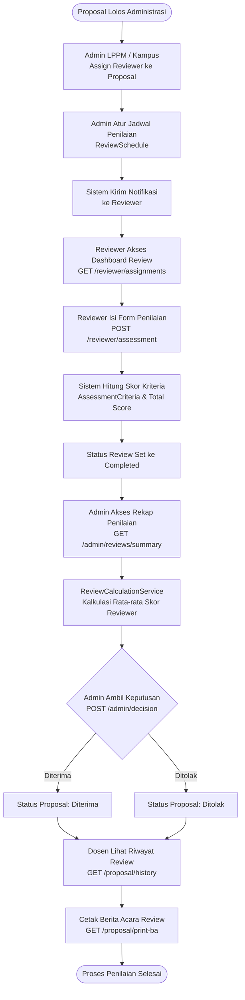
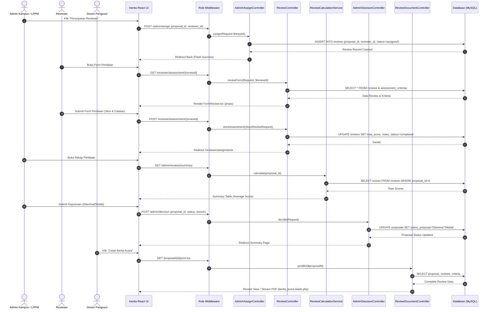

# Alur Proses Bisnis & Diagram (Flowchart & Sequence Diagram) - Modul Manajemen Reviewer dan Penilaian (Kelas B - TAB 2)

Dokumentasi ini melengkapi laporan pengecekan modul pada Issue #262 dengan menggambarkan alur proses bisnis bisnis dan urutan eksekusi teknis endpoint API untuk **Modul 2: Manajemen Reviewer dan Penilaian**.

---

## 1. Diagram Flowchart Proses Bisnis Modul 2

Diagram berikut menggambarkan alur kerja pengguna dari penunjukan reviewer oleh Admin, proses penilaian oleh Reviewer, rekap kalkulasi nilai, hingga penentuan keputusan dan cetak Berita Acara:

---

## 2. Sequence Diagram Eksekusi Endpoint & Controller Modul 2

Diagram berikut mendeskripsikan urutan pemanggilan pesan (message sequence) dari Inertia React UI, Middleware Otorisasi, Controller, Service Calculation, hingga Persistensi Database:

---

## 3. Penjelasan Lifecycle & Status Transisi Modul 2

1. **Status Task Review (`reviews.status`)**:
   - `assigned`: Reviewer telah ditunjuk oleh Admin Kampus / LPPM.
   - `in_progress`: Reviewer sedang mengisi form kriteria penilaian.
   - `completed`: Reviewer telah mengirimkan skor akhir dan catatan penilaian.

2. **Status Proposal Terkait (`proposals.status_proposal`)**:
   - `Administrasi_Valid`: Proposal lolos validasi dokumen dan siap ditunjuk reviewer.
   - `Dalam_Review`: Proposal sedang dalam proses penilaian oleh reviewer.
   - `Diterima`: Proposal disetujui berdasarkan rata-rata nilai rekap review.
   - `Ditolak`: Proposal tidak lolos penilaian subtansi review.
